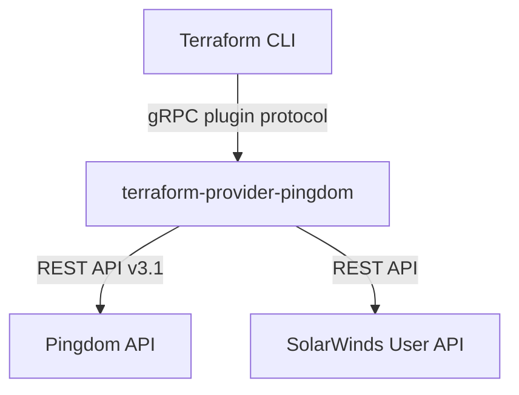

# Architecture

## Overview

`terraform-provider-pingdom` is a Terraform provider that manages Pingdom monitoring resources through the Pingdom API v3.1. It allows teams to declare uptime checks, contacts, teams, integrations, and maintenance windows as infrastructure-as-code.

## System Context

Terraform invokes the provider binary over gRPC. The provider translates Terraform resource operations (CRUD) into Pingdom REST API calls through the `go-pingdom` client library.

## Internal Structure

| Directory | Purpose |
| --- | --- |
| `main.go` | Provider entry point — registers the provider with the Terraform plugin system |
| `pingdom/` | All provider logic: resources, data sources, configuration, and tests |
| `docs/` | Terraform Registry documentation (generated and manual) |
| `examples/` | Example Terraform configurations |
| `scripts/` | Build helper scripts (formatting, linting, changelog) |

## Resources and Data Sources

**Resources** (create, read, update, delete):

- `pingdom_check` — HTTP, ping, TCP, and DNS uptime checks
- `pingdom_tms_check` — transaction monitoring checks
- `pingdom_team` — alert notification teams
- `pingdom_contact` — alert notification contacts
- `pingdom_integration` — webhook integrations
- `pingdom_maintenance` — maintenance windows
- `pingdom_occurrence` — maintenance occurrence overrides
- `pingdom_user` — SolarWinds user invitations

**Data sources** (read-only lookups):

- `pingdom_contact`, `pingdom_contacts`
- `pingdom_team`, `pingdom_teams`
- `pingdom_integration`, `pingdom_integrations`

## Data Flow

1. User runs `terraform plan` or `terraform apply`.
2. Terraform calls the provider over gRPC with the desired resource state.
3. `provider.go` routes to the appropriate resource CRUD function.
4. The resource function calls `go-pingdom` client methods.
5. `go-pingdom` sends HTTP requests to the Pingdom API.
6. The provider maps API responses back to Terraform state.

## Key Dependencies

| Dependency | Role |
| --- | --- |
| `hashicorp/terraform-plugin-sdk/v2` | Terraform provider framework (schema, CRUD lifecycle, testing) |
| `mbarper/go-pingdom` | HTTP client for the Pingdom REST API |
| `mitchellh/mapstructure` | Decodes provider config into typed structs |

## Configuration

| Environment Variable | Purpose |
| --- | --- |
| `PINGDOM_API_TOKEN` | Pingdom API authentication token |
| `SOLARWINDS_USER` | SolarWinds portal username (optional) |
| `SOLARWINDS_PASSWD` | SolarWinds portal password (optional) |
| `SOLARWINDS_ORG_ID` | SolarWinds organisation identifier (optional) |
| `TF_ACC` | Set to `1` to run acceptance tests against real API |
